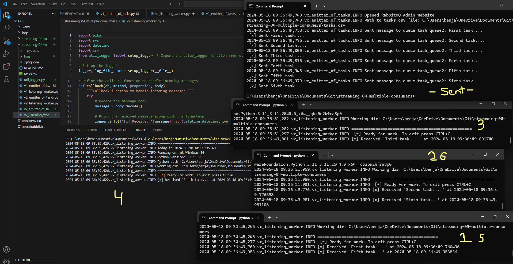

## Ben Robin 5/17/2024

# streaming-04-multiple-consumers

> Use RabbitMQ to distribute tasks to multiple workers

One process will create task messages. Multiple worker processes will share the work. 

## Before You Begin

1. Fork this starter repo into your GitHub. ✓
1. Clone your repo down to your machine. ✓
1. View / Command Palette - then Python: Select Interpreter ✓ select my .venv envirnment
1. Select your conda environment. ✓ maybe I did this on the previous step? 

## Read

1. Read the [RabbitMQ Tutorial - Work Queues](https://www.rabbitmq.com/tutorials/tutorial-two-python.html) ✓
1. Read the code and comments in this repo. ✓

## RabbitMQ Admin 

RabbitMQ comes with an admin panel. When you run the task emitter, reply y to open it. 

(Python makes it easy to open a web page - see the code to learn how.)

## Execute the Producer

1. Run emitter_of_tasks.py (say y to monitor RabbitMQ queues) ✓
 
 my results -- 

PS C:\Users\benja\OneDrive\Documents\Git> .\.venv\Scripts\activate
.\.venv\Scripts\activate : File C:\Users\benja\OneDrive\Documents\Git\.venv\Scripts\Activate.ps1 cannot be loaded because running scripts is disabled on this system. For more information, see about_Execution_Policies at 
https:/go.microsoft.com/fwlink/?LinkID=135170.
At line:1 char:1
+ .\.venv\Scripts\activate
+ ~~~~~~~~~~~~~~~~~~~~~~~~
    + CategoryInfo          : SecurityError: (:) [], PSSecurityException
    + FullyQualifiedErrorId : UnauthorizedAccess
PS C:\Users\benja\OneDrive\Documents\Git> Set-ExecutionPolicy -Scope Process -ExecutionPolicy Bypass
PS C:\Users\benja\OneDrive\Documents\Git> .\.venv\Scripts\activate
(.venv) PS C:\Users\benja\OneDrive\Documents\Git> & c:/Users/benja/OneDrive/Documents/Git/.venv/Scripts/python.exe c:/Users/benja/OneDrive/Documents/Git/streaming-04-multiple-consumers/util_logger.py
(.venv) PS C:\Users\benja\OneDrive\Documents\Git> & c:/Users/benja/OneDrive/Documents/Git/.venv/Scripts/python.exe c:/Users/benja/OneDrive/Documents/Git/streaming-04-multiple-consumers/v1_emitter_of_tasks.py
Would you like to monitor RabbitMQ queues? y or n y

 [x] Sent First task...

Explore the RabbitMQ website.

## Execute a Consumer / Worker

1. Run listening_worker.py ✓

Will it terminate on its own? How do you know?  It will not note: - Use Control c to close a terminal and end a process.

(.venv) PS C:\Users\benja\OneDrive\Documents\Git> & c:/Users/benja/OneDrive/Documents/Git/.venv/Scripts/python.exe c:/Users/benja/OneDrive/Documents/Git/streaming-04-multiple-consumers/v1_listening_worker.py
 [*] Ready for work. To exit press CTRL+C
 [x] Received First task...
 [x] Done

## Ready for Work

1. Use your emitter_of_tasks to produce more task messages. ✓

## Start Another Listening Worker 

1. Use your listening_worker.py script to launch a second worker.  ✓

(.venv) PS C:\Users\benja\OneDrive\Documents\Git> & c:/Users/benja/OneDrive/Documents/Git/.venv/Scripts/python.exe c:/Users/benja/OneDrive/Documents/Git/streaming-04-multiple-consumers/v1_emitter_of_tasks.py
Would you like to monitor RabbitMQ queues? y or n y

 [x] Sent First task...
(.venv) PS C:\Users\benja\OneDrive\Documents\Git> & c:/Users/benja/OneDrive/Documents/Git/.venv/Scripts/python.exe c:/Users/benja/OneDrive/Documents/Git/streaming-04-multiple-consumers/v1_emitter_of_tasks.py
Would you like to monitor RabbitMQ queues? y or n y

 [x] Sent First task...
(.venv) PS C:\Users\benja\OneDrive\Documents\Git> & c:/Users/benja/OneDrive/Documents/Git/.venv/Scripts/python.exe c:/Users/benja/OneDrive/Documents/Git/streaming-04-multiple-consumers/v1_listening_worker.py
 [*] Ready for work. To exit press CTRL+C
 [x] Received First task...
 [x] Done
 [x] Received First task...
 [x] Done

(.venv) PS C:\Users\benja\OneDrive\Documents\Git> & c:/Users/benja/OneDrive/Documents/Git/.venv/Scripts/python.exe c:/Users/benja/OneDrive/Documents/Git/streaming-04-multiple-consumers/v2_emitter_of_tasks.py
Would you like to monitor RabbitMQ queues? y or n y

 [x] Sent Second task.....

Follow the tutorial. 
Add multiple tasks (e.g. First message, Second message, etc.)
How are tasks distributed? 
Monitor the windows with at least two workers. 
Which worker gets which tasks?

## Reference

- [RabbitMQ Tutorial - Work Queues](https://www.rabbitmq.com/tutorials/tutorial-two-python.html)

## Screenshot

See a running example with at least 3 concurrent process windows here:
